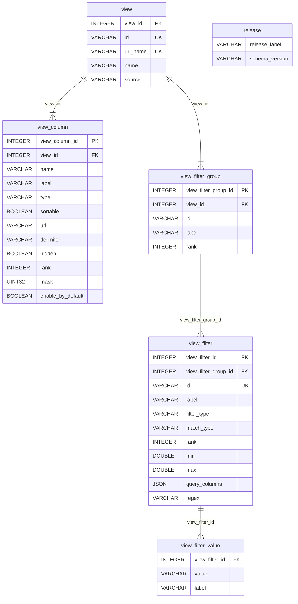

# Data portal ETL v2

A tool for generating data portal release databases. It validates configuration, transforms source CSVs, and produces a self-contained DuckDB database ready for use by Ensembl data portals such as the AMR Portal and similar.

## Requirements

- Python >= 3.12
- [uv](https://docs.astral.sh/uv/) (recommended)

## Installation

```bash
uv sync
```

For YAML configuration support:

```bash
uv sync --extra yaml
```

## Usage

```
usage: main.py [-h] -r RELEASE -c CONFIG -d DATA [--schema SCHEMA] [-f] [-v]
```

| Argument | Required | Description |
|----------|----------|-------------|
| `-r`, `--release` | Yes | Release name (used as the output directory and database name) |
| `-c`, `--config` | Yes | Configuration file (JSON, JSON5, or YAML) defining views, filters, and column overrides |
| `-d`, `--data` | Yes | Data source file (JSON, JSON5, or YAML) detailing datasets |
| `--schema` | No | Directory containing JSON Schema files for validation. Defaults to `schema/` |
| `-f`, `--force` | No | Overwrite an existing release directory if present |
| `-v`, `--verbose` | No | Enable debug-level logging |

### Supported file formats

Configuration and data files can be written in any of the following formats:

| Format | Extensions | Notes |
|--------|-----------|-------|
| JSON | `.json` | Standard JSON |
| JSON5 | `.json`, `.json5` | JSON with comments (`//`, `/* */`) and trailing commas. Any valid JSON is valid JSON5 |
| YAML | `.yml`, `.yaml` | Requires the optional `pyyaml` dependency (`uv sync --extra yaml`) |

JSON Schema validation files (`schema/`) are always plain JSON and are not affected by this setting.

### Examples

```bash
# Using JSON
uv run python main.py -r example_v1 -c example/config.json -d example/data.json

# Using JSON5 (supports comments and trailing commas)
uv run python main.py -r example_v1 -c example/config.json5 -d example/data.json5

# Using YAML (requires: uv sync --extra yaml)
uv run python main.py -r example_v1 -c example/config.yaml -d example/data.yaml
```

## Pipeline stages

1. **Validate configurations** -- config and data files are validated against their JSON schemas and parsed into Pydantic models
2. **Transform datasets** -- source CSVs are loaded, filtered, and any generated columns are created
3. **Process dataset metadata** -- column names are extracted per dataset from the transformed parquet files
4. **Precompute filter values** -- for `select_list` filters, distinct values and labels are computed from the dataset. Query column references are validated against the data source. Per-view column overrides are applied and columns are enriched with metadata
5. **Build configuration database** -- metadata tables (view, view_column, view_filter_group, view_filter, view_filter_value, release) are written to DuckDB
6. **Load data** -- transformed dataset parquet files are loaded into DuckDB as their own tables

## Configuration

See [CONFIG_README.md](CONFIG_README.md) for full documentation of configuration and data files.

## Development

Install dev dependencies:

```bash
uv sync --group dev
```

### Testing

```bash
uv run pytest
```

Tests live under `tests/` and use shared fixtures defined in `tests/conftest.py`.

### Linting and formatting

```bash
# Format code
uv run black etl/ tests/

# Sort imports
uv run isort etl/ tests/

# Lint with ruff
uv run ruff check etl/ tests/

# Type checking
uv run mypy etl/
```

Ruff can also auto-fix issues:

```bash
uv run ruff check --fix etl/ tests/
```

## DuckDB schema



The schema also includes two convenience views:

- **filter_config** -- joins `view_filter`, `view_filter_group`, and `view` to provide a denormalised view of all filter settings per view
- **column_config** -- joins `view_column` and `view` to provide a denormalised view of all column metadata per view


## Column selection

Column selection can be done using a bitmask. The will allow up to 420 columns to be enabled or disabled using a single unsigned 32-bit integer.

When the ETL runs it generates a mask for every column in a view using the `col_mask` macro 

```
CREATE MACRO mask_set(i) AS floor(i / 28); -- used to generate bit mask set
CREATE MACRO col_mask(i)  AS (mask_set(i)::UINT32 << 28) + (1 << (i - (mask_set(i) * 28))::UINT32); -- convert a index into a mask
```

This mask can then be used on the client to calculate the column selection by applying the & bitwise operator to the mask of every selected column.

For example if the user selected the first three columns

- 1 - genome_uuid
- 2 - assembly
- 4 - scientific name

The selection value would be 7 (0001 + 0010 + 0100)

On the server side to convert this value into the selected columns you can use the macro `get_view_columns` that accepts the view source and a uint32.

```
CREATE MACRO get_view_columns(view_source, target_mask) AS -- returns a list of columns based on a mask
(
  SELECT list(vc."name" ORDER BY vc.rank ASC) from view_column as vc JOIN "view" as v on v.view_id = vc.view_id
  where target_mask::UINT32 & vc.mask and v."source" = view_source
);
```

## Macros

There are two types of macros generated by the ETL, column helpers, and filter helpers

### Column helpers

| macro | arguments | usage | example |
|-------|-----------|-------|---------|
| mask_set | uint32 | Used to calculate the bitmask set a index belongs to | select * from mask_set(200) |
| col_mask | uint32 | Used to calculate a bitmask for a index | select * from col_mask(30) |
| get_view_columns | view_source, target_mask | gets a list of columns for a given uin32 and view_source | Select * FROM get_view_columns('example_dataset',10) |
| get_view_default_column_masks | view_source | gets a list of column masks that are visible by default | select * FROM get_view_default_columns_masks(view_source) |


### Filters

| macro | filter type | arguments | example |
| select_list_filter | select_list | table_name, column_name, in_list | SELECT * FROM select_list_filter('test','class',['class A']) |
| select_exact_filter | select_exact | table_name, column_name, selected_value | SELECT * FROM select_exact_filter('filter_1','id','ID1') |
| select_prefix_filter | select_prefix | table_name, column_name, selected_value | SELECT * FROM select_prefix_filter('gene_data','symbol','KIR') |
| range_filter | range | table_name, column_name, range_start, range_end | select * from range_filter('test','start',1,10) |

currently the following filters types lack a macro
- list_contains - uses the json object field
- location - uses a regex to parse and match

The purpose of the macro is to make filtering the ETL easier, this can be done by using the macro to generate a select per filter and then combining them with a `with` statement

For example
```
with 
    filter_1 as (SELECT * FROM select_list_filter('test','class',['class A'])),
    filter_2 as (SELECT * FROM select_exact_filter('filter_1','id','ID1'))
SELECT columns(['id', 'class', 'stop']) FROM filter_2;
```

in this example it is expected that you have already ran `get_view_columns` to generate the list of columns. I would like to integrate this in the future but was not able to get it working nicely